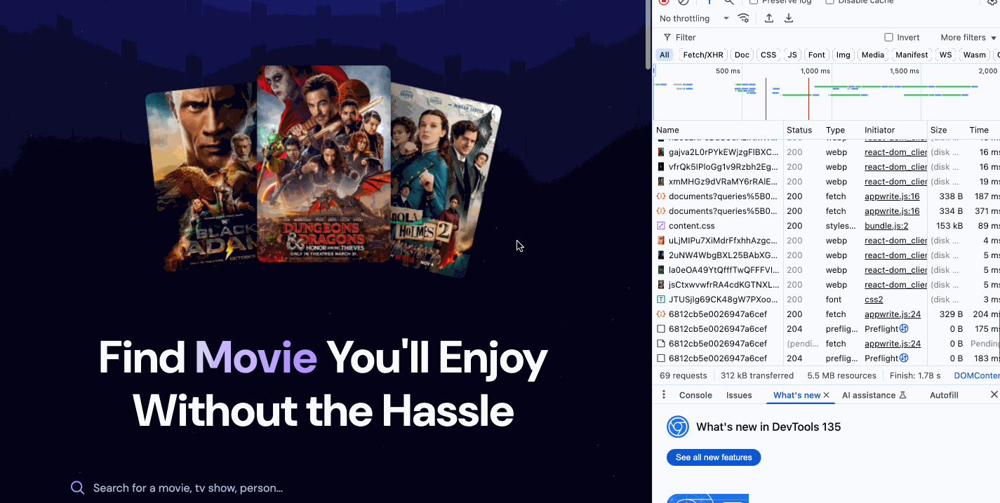

# Movie Finder Demo



## Overview
The **Movie Finder App** is a React-based web application that allows users to search for movies, view trending movies, and explore detailed information about each movie. It integrates with **The Movie Database (TMDb)** API for movie data and **Appwrite** for tracking search trends.

## Features
- **Search Movies**: Search for movies by title using a debounced input field.
- **Trending Movies**: Display a list of trending movies based on user search trends.
- **Movie Details**: View movie details such as title, rating, release year, and language.
- **Responsive Design**: Fully responsive UI with modern styling using Tailwind CSS.

## Technologies Used
- **React**: Frontend framework for building the user interface.
- **Appwrite**: Backend service for managing search trends and database operations.
- **TMDb API**: Source for movie data.
- **Tailwind CSS**: Utility-first CSS framework for styling.
- **Vite**: Build tool for fast development.

## Takeaways
- **Debounced Search**: Implemented using `react-use` to optimize API calls.
- **State Management**: Managed with React hooks (`useState`, `useEffect`).
- **Error Handling**: Gracefully handles API errors and displays user-friendly messages.
- **Appwrite Integration**: Tracks and updates search trends in real-time.
- **Responsive UI**: Built with Tailwind CSS for a seamless experience across devices.

## Folder Structure
```
src/
├── components/
│   ├── MovieCard.jsx
│   ├── Search.jsx
│   ├── Spinner.jsx
├── App.jsx
├── appwrite.js
├── index.css
```

## License
This project is licensed under the MIT License.